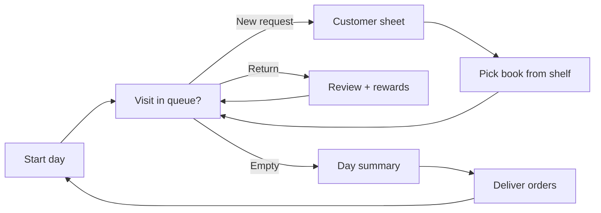
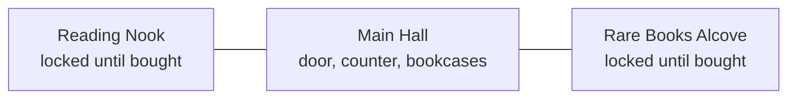

# Foxglove Library — Prototype Spec for Claude Code

## Overview

Build a playable Godot prototype of Foxglove Library: a cozy fae library sim where you recommend real books to customers and order new stock. The goal is to test whether the core loop is fun, not to ship. Placeholder art only.

The player runs a small enchanted library. Each in-game day, customers arrive with requests, the player picks a book from the shelves, and the customer returns a few days later with a review. Between customers, the player spends acorns (the currency) on new arrivals and manages limited shelf space.

**How to use this doc with Claude Code:** paste it in (or save it as `SPEC.md` in the repo root) and ask Claude Code to build it following the Build order section, one step at a time, running the project in Godot between steps.

## Tech stack and setup

Use Godot 4 (latest stable) with GDScript, in a 2D project set to portrait. Develop and test on desktop in the Godot editor, and export to Android or iOS later.

| Concern | Choice | Notes |
| --- | --- | --- |
| Engine | Godot 4, GDScript | Not C#, to keep mobile export simple |
| Display | 1080×1920 base, portrait | Stretch mode `canvas_items`, aspect `expand`; set a 540×960 test window size for desktop |
| Game state | `GameState.gd` autoload singleton | Holds all state, emits signals (`acorns_changed`, `visit_started`, etc.) that UI listens to |
| Logic | Plain scripts under `res://logic/` | Static functions for matching, day loop, orders, trending, affinity; no node dependencies |
| Persistence | JSON save at `user://save.json` | Save after every action; Reset button in Journal |
| Data | JSON files under `res://data/` | Loaded once at startup; no network calls |
| Animation | `Tween` for UI and movement, `AnimationPlayer` for reusable effects, `GPUParticles2D` for dust and sparkles | See Library scene section |
| Tests | GUT (Godot Unit Test) addon | Tests for matching, order limits, trending rerolls |
| Fonts | Fraunces and Nunito Sans TTFs in `res://fonts/` | Both free on Google Fonts; set in the Theme resource |

Suggested folders: `res://scenes/` (Library, zones, Customer, UI sheets), `res://ui/` (tab bar, sheets, Theme resource), `res://logic/`, `res://data/`, `res://art/` (placeholders now, your art later), `res://tests/`.

**Working with Claude Code:** it can write the GDScript files and `.tscn` scenes directly, but you run the game by opening the project in the Godot editor. Ask it to keep node trees in `.tscn` files rather than building them in code, so you can adjust layout and swap in art by hand.

## Game loop and rules

A day has a queue of 3 to 4 visits, which are a mix of new requests and returns of earlier loans. When the queue is empty, the player ends the day and sees a short summary.



The player can open Orders or Journal at any time between visits.

Core rules:

- **Starting state:** 140 acorns, reputation 0, 40 shelf slots, about 30 books on the shelves, 4 unlocked customers.
- **Loans:** a recommended book leaves the shelf. The customer returns it 1 to 3 days later (random), and the book goes back on the shelf.
- **Questions:** each request allows 1 question, which reveals one hidden preference tag.
- **Rewards on return:** based on match score (see Matching). Hearts 1 to 5, reputation from −2 to +12, tip from 0 to 20 acorns.
- **Discovery:** each return reveals one new preference tag in that customer's journal entry, whether the match was good or bad.
- **Unlocks:** new customers appear at reputation 10, 25 and 45.
- **Orders:** placed any time, delivered at the start of the next day. The order can't exceed free shelf slots or current acorns.
- **Weeding:** the player can remove any book on the shelf to free a slot, for a 5 acorn refund. Books not loaned in 7 days get a "dusty" marker.
- **Daily income:** 10 acorns per day in library fees, so the player can't get permanently stuck.

## Data model

All matching runs on a shared vocabulary of tags, so books and customers must use the same tag strings. Start with this list and grow it later: `cozy`, `found-family`, `low-stakes`, `romance`, `slow-burn`, `enemies-to-lovers`, `fae`, `dark`, `gothic`, `sad`, `hopeful`, `funny`, `mystery`, `adventure`, `literary`, `sci-fi`, `historical`, `short`, `long`, `series`, `standalone`, `war`, `magic-school`.

The types below are written TypeScript-style for readability. In Godot, implement Book, Customer, DecorItem and Gift as `Resource` classes (or typed Dictionaries) loaded from JSON, and keep GameState in the `GameState.gd` autoload.

```ts
type Tag = string;

type Book = {
  id: string;          // ISBN-13
  title: string;
  author: string;
  tags: Tag[];         // 3–6 tags
  blurb: string;       // your own short blurb, not the publisher's
  spineColor: string;  // hex, generated if missing
  price: number;       // acorns, 12–30
  popularity: number;  // 1–5, drives demand hints
  rare?: boolean;      // only offered once the Rare Books Alcove is built
};

type Customer = {
  id: string;
  name: string;
  description: string;       // "moth-winged courier"
  likes: Tag[];              // hidden until discovered
  dislikes: Tag[];           // hidden until discovered
  requests: Request[];       // pool to draw from
  unlockAtRep: number;
  giftLikes: string[];       // 2 gift ids
  giftDislikes: string[];    // 1 gift id
  backstory: string;         // unlocks at affinity 3
  specialRequest: Request;   // unlocks at affinity 4
};

type DecorItem = { id: string; name: string; tags: Tag[]; price: number; needsRoom?: 'nook' | 'alcove' };
type Gift = { id: string; name: string; price: number };

type Request = {
  text: string;              // what they say
  wants: Tag[];              // tags this request is about
  avoid: Tag[];
  bookId?: string;           // set for specific-title requests
};

type ShelfCopy = { copyId: string; bookId: string; lastLoanDay: number | null };

type Loan = {
  copyId: string; bookId: string; customerId: string;
  request: Request; dayOut: number; dayBack: number;
};

type GameState = {
  day: number;
  acorns: number;
  reputation: number;
  shelf: ShelfCopy[];
  loans: Loan[];
  queue: Visit[];                      // today's remaining visits
  discovered: Record<string, Tag[]>;   // customerId -> revealed tags
  history: ReviewRecord[];
  pendingOrder: string[];              // bookIds, delivered next day
  catalogToday: string[];              // bookIds offered in Orders today
  trending: string[];                  // 3 bookIds, rerolled every 5 days
  nextTrending: string[];              // pre-rolled, one title leaked as a rumor
  trendingRerollDay: number;
  bookcases: number;                   // shelfCapacity = 40 + 10 * bookcases
  rooms: { nook: boolean; alcove: boolean };
  decor: string[];                     // owned DecorItem ids, max decorSlots
  affinity: Record<string, number>;    // customerId -> 0–5
  giftedToday: string[];               // customerIds already gifted today
};
```

`Visit` is either `{ kind: 'request', customerId, request, questionsLeft: 1 }` or `{ kind: 'return', loan }`. `ReviewRecord` stores customer, book, hearts, the review line and the day.

## Library scene and zones

The home screen is a 2D side-view library scene, not a flat list. It's wider than the screen, and the player pans left and right through three zones, each a separate scene instanced into `Library.tscn`.



- **Main Hall (center, starting view):** the entrance door, the librarian's counter, and bookcases along the back wall. The hall starts with 4 bookcases (40 slots) and each purchased bookcase appears as a new case, extending the hall to the right of the counter.
- **Reading Nook (left):** shown dimmed behind a boarded-up archway with a "For sale" sign until bought. Once unlocked, the boards come off with an animation and the nook has a hearth, armchairs and one short bookcase. Customers "reading in the nook" sit here until evening.
- **Rare Books Alcove (right):** shown behind a locked wrought-iron gate until bought. Once unlocked, the gate swings open, and rare books live on a glass-fronted case here, separate from the main shelves.
- **Camera:** a `Camera2D` that pans by drag with inertia, clamped to unlocked zones. Small zone buttons (Nook · Hall · Alcove) above the tab bar snap the camera with a tween.
- **Decor anchors:** each zone has fixed `Marker2D` anchor points, which are the decor slots. Bought decor appears at the next free anchor in a zone that suits it (nook-only decor goes in the nook). This keeps placement simple while still looking furnished.
- **Books on shelves:** each bookcase instances `Spine` nodes for its copies. Spines use the same placeholder look as the mockups (colored rectangle, vertical title), with height and width seeded from the book id. Tapping a spine selects it.

**Animations to include (placeholder art is fine):**

| Moment | Animation |
| --- | --- |
| Customer arrives | Door swings, chime particles, customer walks from door to counter |
| Customer leaves | Walks back out; a lent book is shown in their hands |
| Picking a book | Spine slides out of the shelf and tilts toward the camera |
| Return and review | Hearts pop in one at a time; acorns and reputation tick up |
| Dusty books | Faint dust particles drift off spines not loaned in 7 days |
| Trending books | Slow gold sparkle on the spine |
| Buying decor | Item fades and scales into its anchor with a small sparkle |
| Unlocking a zone | Boards fall or gate swings; camera pans to show the new zone |
| Time of day | `CanvasModulate` tint shifts from morning to dusk as visits pass |

**Placeholder art:** use `ColorRect`, `Polygon2D` and `Label` nodes for walls, floor, bookcases, customers (arch-shaped silhouettes with a name label) and decor (simple shapes with a name). Structure each as its own scene with a `Sprite2D` or `AnimatedSprite2D` slot, so real art drops in without changing code. Customer scenes should have idle, walk, happy, neutral and sad states.

UI sheets (customer dialog, BookCard, gift picker, day summary) are `Control` nodes on a `CanvasLayer` above the scene, and slide up from the bottom with a tween.

## Screens

Seven screens: four tabs plus three modal flows. Furnish is new and has no mockup yet. All screens are portrait phone layouts.

1. **Library (tab, home)**
   - Header: day number, acorns, reputation.
   - Filter chips: All plus one chip per common tag. Filtering dims non-matching spines rather than hiding them.
   - The library scene (see Library scene and zones), with bookcases of about 10 spines each on wooden planks. Spine height and width vary slightly per book, seeded from the id so they stay stable. Title runs vertically on the spine.
   - Tapping a spine opens a small BookCard sheet (title, author, tags, blurb, copies on shelf, times loaned, weed button).
   - Bottom card: "The door chime rings" with the next visitor's portrait and a Greet button. When the queue is empty, it becomes an "End day" button.
2. **Customer (modal)**
   - Large portrait placeholder, then a bottom sheet with name, visit count, the request text, discovered tags as chips and one dashed "? ? ?" chip if tags remain hidden.
   - Buttons: "Ask (1 left)" reveals one hidden like or dislike tag with a short line of dialog. "Find a book" enters pick mode.
3. **Pick mode (Library in a special state)**
   - The request is pinned in a banner at the top. Tapping a spine lifts it and opens the BookCard with "Recommend" and "Keep looking."
   - Recommend creates a loan, removes the copy from the shelf, shows a one-line reaction, and returns to the Library.
4. **Return (modal)**
   - Portrait with expression picked from hearts (sad, neutral, delighted), book title, 1–5 hearts, review line, and a rewards box (reputation, tip, new journal tag).
5. **Orders (tab)**
   - Acorns and shelf space stat cards, showing the result after the pending order ("140 → 75", "38 + 3 / 40").
   - A warning banner if the order exceeds shelf space or acorns, with a link to weed dusty books.
   - Today's catalog: 6 books from `books.json` not already owned, weighted by popularity and by tags that unlocked customers like, plus any trending books under 3 copies (marked "Trending"). Each row shows a spine swatch, title, author, a demand hint and price, with an Add or Added toggle.
   - Button: "Place order · N books · X acorns."
6. **Journal (tab)**
   - List of unlocked customers with portrait, discovered likes and dislikes, and their last three reviews.
   - A Reset game button at the bottom, with a confirm dialog.

**Furnish (tab):** three sections in one scrolling list. **Rooms and bookcases** shows the next bookcase price, shelf capacity, and the two rooms with lock state. **Decor** shows used and total decor slots, then a card per item with its tags as chips, the regulars it attracts (only those already unlocked), price, and Buy or Remove. Gifts are not sold here; they're bought at the moment of giving.

**Gift picker (small sheet):** opened from "Give a gift" on the customer sheet or in the Journal. Lists the six gifts with prices, marked liked, disliked or "?" based on what's discovered. Disabled if already gifted today. The Journal entry also shows an affinity meter of 5 small leaves.

Day summary is a simple modal at End day: loans out, returns, acorns and reputation earned, and any new customer unlocked.

## Matching and scoring

A match score comes from tag overlap between the book, the request and the customer's hidden taste. Write it as a pure function `score_match(book, request, customer) -> int` in `res://logic/match.gd`.

| Book tag is in… | Points per tag |
| --- | --- |
| request.wants | +3 |
| customer.likes | +2 |
| request.avoid | −4 |
| customer.dislikes | −3 |

Add a small random factor of −1 to +1 so the same pick isn't always identical. Then map the score to results:

| Score | Hearts | Reputation | Tip (acorns) |
| --- | --- | --- | --- |
| 7 or more | 5 | +12 | 20 |
| 4 to 6 | 4 | +7 | 12 |
| 1 to 3 | 3 | +3 | 5 |
| −2 to 0 | 2 | 0 | 0 |
| −3 or less | 1 | −2 | 0 |

Review lines come from templates per heart level, with the book title and one matched or clashing tag filled in, for example "I loved how {tag} it was" or "Too much {tag} for me, honestly." Write 4 templates per heart level in `data/reviews.json`.

All numbers here are first guesses, so put them in one `res://logic/tuning.gd` constants file.

## Specific-title requests and trending books

About 1 in 3 requests name a specific book. Having a copy on the shelf earns reputation, while a missing or loaned-out book costs it, so stocking extra copies of trending books pays off.

**Generating a specific request:** at queue generation, each new request has a 35% chance to be specific. The book comes from the current trending list 60% of the time, otherwise from all books weighted by popularity. The customer's line comes from templates, for example "Do you have {title}? Everyone at the market is talking about it."

**Customer sheet for a specific request:** show the requested title as a highlighted chip and hide the Ask button. The buttons change based on the shelf:

| Situation | Buttons | Result |
| --- | --- | --- |
| Copy on shelf | "Hand it over", "Suggest something else" | Hand it over: +4 reputation, +5 acorns, normal loan; the return review is 4–5 hearts |
| Owned, all copies loaned out | "Sorry, it's out", "Suggest something else" | −2 reputation |
| Not owned | "We don't have it", "Suggest something else" | −4 reputation; the book gets a "{name} asked for this" demand hint in Orders |
| Suggest something else (any case) | Enters pick mode | The out or missing penalty applies first, then normal matching with hearts capped at 3 |

**Trending list:**

- `trending` holds 3 book ids and rerolls every 5 days, weighted by popularity, never repeating the previous cycle's picks.
- One day before each reroll, a "Market whispers" notice at day start reveals one of the upcoming trending titles, so a planning player can order early.
- Trending books get a small lamplight-gold badge on their spine in the Library and in the BookCard. In Orders, all trending books not at 3+ copies always appear in the catalog, marked "Trending".
- When a book stops trending, extra copies naturally go dusty, which feeds back into weeding.

**Day summary** adds a "Missed requests" line (out or not owned) so the player learns why reputation dropped.

All percentages and reputation values here go in `tuning.gd` with the rest.

## Spending acorns: furnishing and gifts

Besides books, acorns buy bookcases, two new rooms, decor and gifts. Decor is the key one: it decides which kinds of patrons show up, so players shape the library around the books they actually like.

### Decor

Each decor item carries 2–3 tags. Owned decor pulls in patrons and requests with those tags, so a gothic-looking library fills with gothic readers.

- **Decor slots:** 4 to start, +2 for each room unlocked. Players must choose an identity rather than buy everything.
- **Selling back:** any decor can be removed for a 50% refund.
- **Effect on visits:** each regular's spawn weight is 1 + the number of their liked tags that appear on owned decor. When generating a request's `wants` tags, decor tags get double weight.
- **Wanderers:** once any decor is owned, one visit per day is a one-off wanderer (generated name and description) whose request is built from a random owned decor tag. This makes decor matter even with few regulars unlocked.

| Decor | Tags | Price (acorns) | Needs |
| --- | --- | --- | --- |
| Mushroom lanterns | cozy, fae | 35 | — |
| Candelabra and velvet drapes | gothic, romance, slow-burn | 50 | — |
| Star charts | sci-fi, mystery | 45 | — |
| Thorned rose arch | fae, dark, enemies-to-lovers | 55 | — |
| Pressed-flower garland | romance, hopeful | 30 | — |
| Toadstool cushions | funny, short, magic-school | 35 | — |
| Old map wall | adventure, historical | 40 | — |
| Owl perch and quill stand | literary, historical | 60 | Rare Books Alcove |
| Hearth and patchwork chairs | cozy, found-family, low-stakes | 60 | Reading Nook |

### Bookcases

Each bookcase adds 10 shelf slots. The first costs 60 acorns and each one after costs 1.5× the last (60, 90, 135, 200…), up to a capacity of 100 slots.

### Rooms

| Room | Cost | Unlocks at rep | Effect |
| --- | --- | --- | --- |
| Reading Nook | 150 | 15 | +2 decor slots, +1 visit per day. Books tagged `short` can be "read in the nook" and come back the same evening, so feedback is instant |
| Rare Books Alcove | 250 | 30 | +2 decor slots. Adds rare books to the Orders catalog (price 40–60, `rare: true`). A good match with a rare book earns double reputation. Introduces The Collector, who only asks for specific rare titles |

### Gifts for regulars

Players can give each regular one gift per day from the customer sheet ("Give a gift") or from their Journal entry. Gifts raise **affinity**, from 0 to 5.

- **Gift list:** honey cake (10), moonlit tea (12), pressed violet (8), silver thimble (20), squid ink (15), acorn-cap hat (18). Each regular has 2 liked gifts and 1 disliked gift, shown as "?" until discovered.
- **Affinity gain:** liked gift +2, neutral +1, disliked +0 with a grumpy line (and the dislike is revealed). A 4–5 heart return also adds +1.

| Affinity | Reward |
| --- | --- |
| 2 | All of their dislikes are revealed in the Journal |
| 3 | A short backstory unlocks in the Journal |
| 4 | They make one special request worth triple rewards |
| 5 | They bring a free rare book for the shelf and tip +5 acorns on every future return |

## Visual style and placeholder art

No image assets are needed for the prototype; placeholder art is built from simple nodes (see Library scene and zones). Put colors in `res://ui/palette.gd` and apply them through the Theme resource.

| Token | Hex | Use |
| --- | --- | --- |
| moss | #1E2720 | Main background |
| mossDeep | #141A15 | Modal backdrop |
| mossSurface | #2A362C | Stat pills, banners |
| parchment | #F2E9D6 | Sheets and cards |
| parchmentChip | #DCCFB3 | Tag chips on parchment |
| ink | #2B241C | Text on parchment, dark buttons |
| inkMuted | #5A4E3F | Secondary text on parchment |
| mistText | #B9C2B0 | Secondary text on moss |
| lamplight | #E0B156 | Accent, primary action, selected chip |
| plank | #6E4B33 | Shelf plank (shadow #4A3222) |

Spine colors cycle through: #7A3E3A, #3F5E6B, #8C6A2F, #4E6B3F, #5B4570, #A2553A, #2F4A44, #8A7B5A, #6B3550, #3C4F7A.

Fonts: Fraunces (headings, book titles) and Nunito Sans (everything else). Corners are 14–24 px on sheets and buttons, and every touch target is at least 44 px tall.

Placeholders to swap for real art later:

- **Portrait:** a rounded arch-shaped box with the customer's initial and description. Build it as a `Portrait` scene with a `mood` property (sad, neutral, delighted) so real images drop in later.
- **Cover:** a solid spine-colored rectangle with the title in the BookCard.
- **Backdrop:** flat moss walls and a plank floor in the library scene.

## Seed data and ISBNdb notes

For the first build, Claude Code should create a small hand-written `data/books.json` of about 40 well-known books with tags, placeholder blurbs and no ISBNs (use slug ids). Swap in the real database afterward.

**Bringing in your ISBNdb data (later step):**

- Export about 60–100 books from your reading-tracker database into `books.json` with id (ISBN-13), title and author.
- Map ISBNdb subjects to the tag vocabulary with a small script, then hand-check the tags. Tags matter more than anything else for the game feeling right.
- Write your own short blurbs. Use the publisher descriptions only as reference, not in the app.
- Don't bundle cover images. Your ISBNdb license also requires deleting cached data if the subscription ends, so keep the game's book list to fields you can rewrite or that are factual.

**Starting customers** (`data/customers.json`):

| Name | Description | Likes | Dislikes | Sample request | Unlocks at rep |
| --- | --- | --- | --- | --- | --- |
| Wren | Moth-winged courier | cozy, found-family, adventure | sad, war | "Something that feels like coming home. Nothing too sad." | 0 |
| Old Thistle | Retired hedge witch | literary, historical, mystery | romance, series | "Give me a book with some weight to it." | 0 |
| Pip | Changeling apprentice | magic-school, funny, adventure | long, dark | "I need something fun for the train. Short, please!" | 0 |
| Lady Veil | Ghost from 1893 | gothic, romance, slow-burn | sci-fi, funny | "Something with candlelight and longing." | 0 |
| Bramble | Grumpy oak spirit | fae, dark, enemies-to-lovers | cozy, low-stakes | "No fluff. I want teeth." | 10 |
| The Twins | Two pixies who share one book | funny, short, hopeful | sad, literary | "We only have one afternoon. Make it count." | 25 |
| Mirelle | Lake-dwelling scholar | sci-fi, mystery, standalone | romance, series | "Something that makes me think for days." | 45 |

Give each customer 4 requests in the same voice, each with 1–2 `wants` tags and 0–1 `avoid` tags.

## Build order and checklist

Build in this order and run the project in the Godot editor after each step.

1. Create the Godot 4 project (portrait display settings), the GameState autoload, Theme resource, fonts and a bottom tab bar with four tabs.
2. Seed data files and the GameState autoload with JSON save, load and reset.
3. Pure logic in `res://logic/`: day start, queue generation, score_match, return rewards, order delivery. Add GUT tests for score_match and order limits.
4. Library scene: Main Hall with bookcases, spines, camera pan, customer walk-in, filters and BookCard.
5. Customer modal, Ask, and pick mode through to Recommend.
6. Return modal and rewards.
7. Orders tab with catalog, limits and weeding.
8. Journal tab and Day summary, then the Furnish tab (bookcases, rooms, decor anchors, zone unlock animations, and decor's effect on visits), then gifts and affinity.

**Done when:**

- [ ] I can play 5 in-game days start to finish without errors.
- [ ] A good match visibly earns more hearts, reputation and acorns than a bad one.
- [ ] Asking a question reveals a tag, and returns add tags to the Journal.
- [ ] Ordering is blocked when over budget or over shelf space, and weeding frees a slot.
- [ ] Specific requests reward having the book, penalize out or missing books, and trending titles change every 5 days.
- [ ] Buying gothic decor visibly shifts visits toward gothic requests within a few days, and gifts raise affinity through all five rewards.
- [ ] Panning between zones feels smooth, and unlocking the nook and alcove animates them open.
- [ ] Closing and reopening the app keeps my progress; Reset starts fresh.

**Out of scope for now:** final art, sound, network calls, accounts, monetization, and linking to the reading-tracker app.
